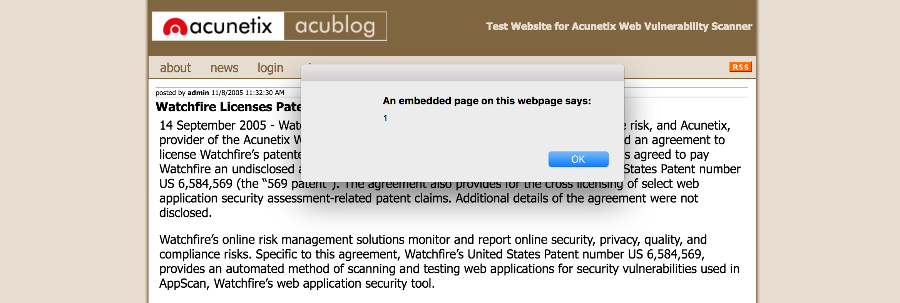
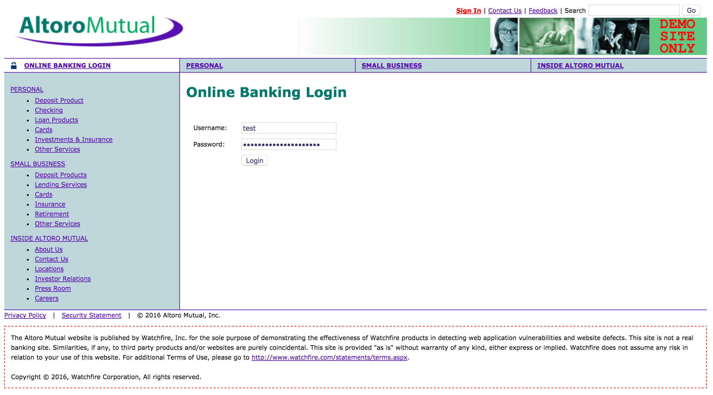
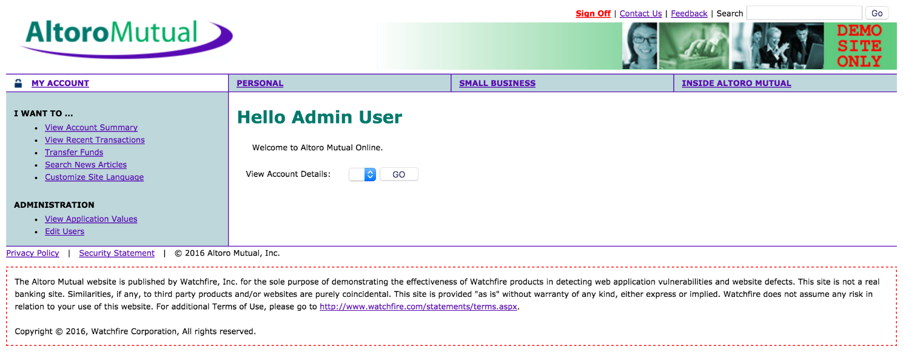
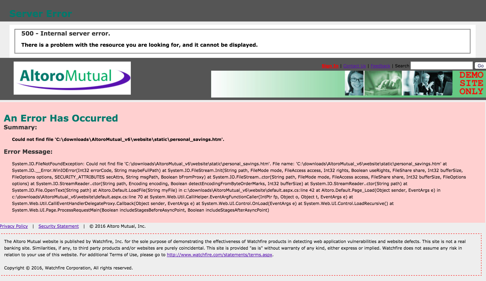

# IS2545 - Deliverable5
### Yichao Chen (yic85), Jingyi Lin (jil173)

We use OWASP ZAP as the security scanner in this security testing.

##Vulnerability 1: Cross Site Scripting  
This attack happens when other users are viewing webpages injected by attacker’s script on the client-side. The attacker can get access to the controls of the website.

####*Question Answers:*

**1. What part of the InfoSec Triad does in this vulnerability attack (confidentiality, integrity, or availability)?**  
* Confidentiality  
   The attacker can inject his code into the webpage to read the information only for authorized users, or he can get access to user’s personal account.  
* Integrity  
   By injection, the attacker can also modify user’s account information, or webpage display.  
* Availability  
   The attacker can provide a fake web link in his injection code, to lead the correct page to a wrong page, so that affect users’ availability.   

**2. What kind of security attack can exploit this vulnerability (interruption, interception, modification, or fabrication)?**   
* Interruption  
By affecting the users’ availability of the website, the attacker can exploit this vulnerability by leading users to another webpage instead of the correct one.  
* Interception  
The vulnerability can be attacked on confidentiality, that means the attacker can get authorized information from users through the security attack, such as user’s personal information or password.  
* Modification  
The attacker may modify or delete user’s account information after the attacker got access to see sensitive personal information.  
* Fabrication  
Some make-up information can be injected into the web page, such as an alert window jump out to show a fake message, or add new personal information for a user.  

**3. Are attacks that exploit this vulnerability active or passive?**  
* Active  
Since the vulnerability can be exploit as modification and fabrication, the attacks can be regarded as active when the attacker trying to modify or overwrite users’ information or change the link to a fake website.  
*  Passive  
If the attacker only view some authorized information but do not generate any modifications, this attack exploit vulnerability passive.  

**4. What business value would be lost due to exploiting this vulnerability (data loss, unauthorized access, denial of service, etc)?**  
* Data loss, unauthorized access, denial of service  
Since the attacker can inject his code into webpages, he can easily modify or manipulate the data in the website, which will cause data loss. By intercept other user’s information, the XSS can let the attacker get unauthorized access to some part of the website. The injected code may also lead other users to a fake malicious webpage thus the website’s normal function will be interrupt.  

**5. What steps should the development team take to fix this vulnerability?**  
    
  1) Duplicate the client-side’s input check, make it also exists in the server-side, so that even the attacker passed the client-side’s check, the malicious action will be detected by the server-side.  
  2) Specify the webpage’s character encoding type such as “UTF-8”. Since if an encoding is not specified, the web browser will try different encoding by guessing which encoding is actually being used by the web page. This will make XSS attacks easily happen.  
  3) Use whitelist to strictly restrict acceptable input.  
  4) Use blacklist to detect the potential attacks or determining which inputs are so malformed that they should be rejected outright.  
  5) Consider all potentially relevant properties of the input from the client-side.  

####*Additional Information:*  
  
**1. The URL of the website with the described vulnerability.**  
  
  http://testaspnet.vulnweb.com/ReadNews.aspx?NewsAd=javascript%3Aalert%281%29%3B&id=0  

**2. Steps taken to exploit the vulnerability.**  
  
  1) Inject a malicious script code, a redirect JavaScript function for example, into a normal webpage. The script will take the user to a phishing site when executed.  
2) Wait potential targets to visit the injected site.  
3) After the target active this code, the code will take him to a fake site, which will trick the user to input his important credential.  

**3. A screenshot (if applicable) of the vulnerability.**  
  
The screenshot shows an alter window caused by this vulnerability. In this alert, it says here is an embedded page on this webpage, and it provides a number 1.
  
  
  
##Vulnerability 2: SQL Injection  
The login credential validation process can be easily manipulated by malicious input. In order to pass the validation, attackers can type [ZAP' OR '1'='1' -- ] as password. Since it is a Boolean condition judge, when it returns true (it must be true here), the attacker can login to the system successfully.  

####*Question Answers:*  

**1. What part of the InfoSec Triad does in this vulnerability attack (confidentiality, integrity, or availability)?**  
* Confidentiality  
Since the attacker can login the website, he can easily read the data or information in it without authorization.  

**2. What kind of security attack can exploit this vulnerability (interruption, interception, modification, or fabrication)?**  
* Interception  
The attacker can use this vulnerability to get information behind the system, which seriously threaten the confidentiality of the website.  

**3. Are attacks that exploit this vulnerability active or passive?**  
* Passive  
Since the attacker just pass the validation and can look at the information behind, he has not done any modifications. Maybe he will do some modifications in the future, however by this attack he did not do it.  

**4. What business value would be lost due to exploiting this vulnerability (data loss, unauthorized access, denial of service, etc)?**　
* Data loss, unauthorized access, confidential information disclosure  
The attacker can access the website’s data and its users account information by exploiting this vulnerability. With the unauthorized access, the data loss and the confidential information disclosure will be two serious consequences.  

**5. What steps should the development team take to fix this vulnerability?**  
  
  1) Terminate the user’s account activity and send confidential notification to inform the user.  
  2) Review the website’s source code.  
  3) Move all validation process from client side to the server side, do not use client side’s input validation.  
  4) Modify the code and avoid create dynamic SQL queries using simple string concatenation.  
  5) Apply a 'whitelist' of allowed characters, or a 'blacklist' of disallowed characters in user input.  
    
####*Additional Information:*  
  
**1. The URL of the website with the described vulnerability.**  
  
  http://demo.testfire.net/bank/login.aspx  
  
**2. Steps taken to exploit the vulnerability.**  
  
  1) Go to the login page: http://demo.testfire.net/bank/login.aspx  
  2) Type in any username in the username textbox, e.g. test.  
  3) Type in [ZAP' OR '1'='1' — ] as the password in the password textbox.  
  4) Click “Login” button.  
  5) Successfully login and can read personal account information.  
    
**3. A screenshot (if applicable) of the vulnerability.**  
  
  The first screenshot shows the login page with the fake input.  
    
    
  The second screenshot shows the successfully login page after the input of the fake password.  
    
    
    
##Vulnerability 3: Application Error Disclosure  
  
The error message showing on the website disclosed sensitive information. It leaks some system internal information to the public, and may contain the path of a sensitive file which will be easily being targeted by attackers.  
  
####*Question Answers:*  
**1. What part of the InfoSec Triad does in this vulnerability attack (confidentiality, integrity, or availability)?**  
* Confidentiality  
With the disclosed information, the attacker can read the sensitive information without any authorizations.  
  
**2. What kind of security attack can exploit this vulnerability (interruption, interception, modification, or fabrication)?**  
* Interception  
This vulnerability can attack on confidentiality of the website, so the security attack of interception can be exploited by this vulnerability.  
  
**3. Are attacks that exploit this vulnerability active or passive?**  
* Passive  
The vulnerability only allows the attacker to intercept the website, so there are no modifications on the web application.  
  
**4. The vulnerability only allows the attacker to intercept the website, so there are no modifications on the web application.**  
* Unauthorized access, confidential information disclosure  
Due to exploiting this vulnerability, with the sensitive leaking message, it will cause unauthorized access and confidential information disclosure. Someone can follow the sensitive message, probably contains a path of the file, to get inside the host and see the files. Then the unauthorized person can get access to the confidential files, to read them and disclosure more sensitive information.  
  
**5. What steps should the development team take to fix this vulnerability?**  
  
  1) Review the source code, fix the codes with disclosure problem.  
  2) Design a custom error page.  
  3) Design and implement a unique error message.   
  4) Use a pair of error identifiers and error details between client and server, and maintain the database to store error identifier and error details.  
  5) Design the error alert process as sending an error identifier to client side, and log the error details on the server side.  
  6) Check code performance regularly, reduce the disclosure risk.  
    
####*Additional Information:*  
  
**1. The URL of the website with the described vulnerability.**  
  
  http://demo.testfire.net/default.aspx?content=personal_savings.htm  
    
**2. Steps taken to exploit the vulnerability.**  
  
  1) Get the error message with sensitive message in it.  
  2) Attack the local server and get access into the file path.  
  3) Read the file without any authorizations.  
    
**3. A screenshot (if applicable) of the vulnerability.**  
  
  The screenshot shows an error message which is directing a file path to a local server location.  
    
